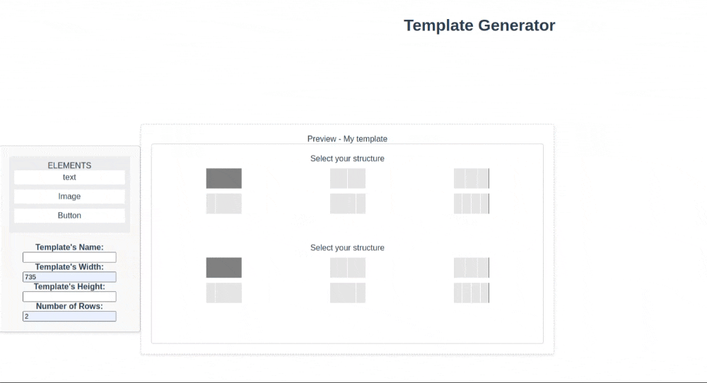

# Modal Preview

This project was an initial prototype created to automate component generation, solving repetitive creation issues. It is a generator of small templates (components) that allows for interactive creation and previewing of templates, using Vue.js for building the user interface.

## Problem to Solve
Creating components for advertising purposes where the format can be a modal, pop ups or others small elements to offer something, but the layout varies. The goal is to automate the construction of these elements, reducing manual work and enabling customization.

## Proposed Solution
A template engine that allows users to model components with specific characteristics (such as name, width, height, and number of rows), save them, and manage them. This engine includes an interface library, enabling users to create their own templates.

## How the Solution Works
1. **Template Structure**: The template is treated as a matrix where each row can contain one or more columns. In these columns, the desired elements (image, text, button, etc.) are inserted.
2. **Modular Components**: Small components (such as image, text, and button) make up the layout. These elements are called “atoms” within the concept of [Atomic Design](https://medium.com/pretux/atomic-design-o-que-%C3%A9-como-surgiu-e-sua-import%C3%A2ncia-para-a-cria%C3%A7%C3%A3o-do-design-system-e3ac7b5aca2c).
3. **Drag-and-Drop Interface**: Uses [HTML5 Drag and Drop](https://www.w3schools.com/html/html5_draganddrop.asp) to facilitate template composition, similar to [Elementor in WordPress](https://kinsta.com/pt/blog/wordpress-elementor/).

## References
* [WordPress Elementor](https://kinsta.com/pt/blog/wordpress-elementor/)
* [Google Images - Elementor WordPress](https://www.google.com/search?q=elementor%20wordpress&tbm=isch&hl=en-US&sa=X&ved=0CCAQtI8BKAJqFwoTCOjrnOD9voEDFQAAAAAdAAAAABAG&biw=1270&bih=647#imgrc=2bqAVReh0MifhM&imgdii=0arBVrG77bhN_M)
* [HTML5 Drag and Drop](https://www.w3schools.com/html/html5_draganddrop.asp)
* [Vue.js Conditional Rendering](https://v2.vuejs.org/v2/guide/conditional#v-show)
* [Learn Vue - Drag and Drop](https://learnvue.co/articles/vue-drag-and-drop)




## Project Setup

### Installation
```sh
npm install
```

### Compiles and hot-reloads for development
```
npm run serve
```

### Compiles and minifies for production
```
npm run build
```

### Lints and fixes files
```
npm run lint
```

### Customize configuration
See [Configuration Reference](https://cli.vuejs.org/config/).
